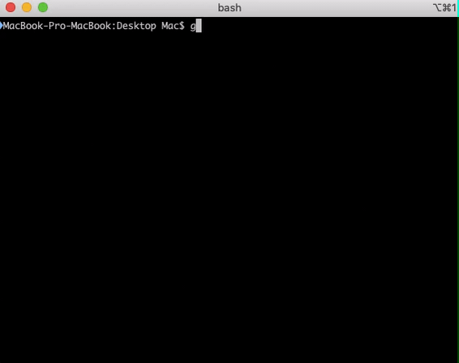
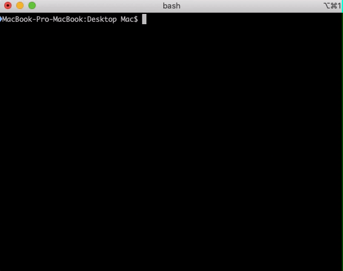

# FDF
A simple 3D height-map renderer. You can rotate models, color is defined by relative height in the map. More features planned!
## Installation
``` 
git clone https://github.com/pechenovadasha/FDF.git
```



```
cd direct/project and run make
```

## The scene

```
./fdf test/mars.fdf
```


```
./fdf test/100-6.fdf
```


## Keys

```
1)Arrow movement.
2)increase and decrease by scrool wheel.
3)Push 'A' to rotate image on axis Y.
4)Push '>' to rotate image on axis X.
5)Push space to Reset.
6)Push 'i' to change  projection.
```
